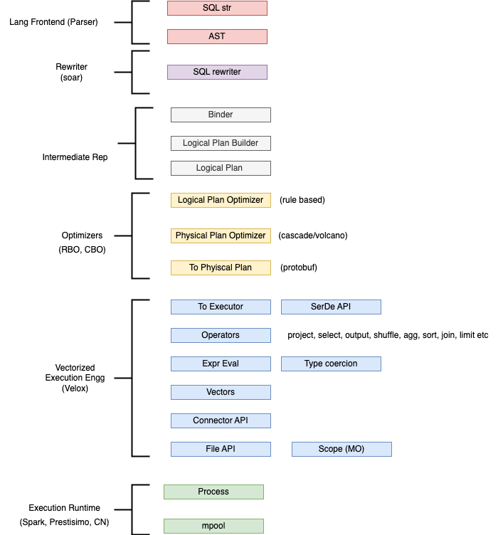

## Tiny SQL Planner

Inspired from [TinySQL](https://github.com/talent-plan/tinysql/tree/course/planner), [Velox](https://github.com/facebookincubator/velox) and [MatrixOrigin](https://github.com/matrixorigin/matrixone).

### Main Components
- Logical Optimizer (Rule Based) [here](pkg/c_sql/b_planner/planlogical/b_builder_test.go). Right now it only supports `Column Pruner`.

### Design

### TODO
- [x] Implement Parser
- [x] Implement Logical Plan Builder
- [x] Implement Logical Plan `Rule Based` Optimizer
- [ ] Implement Operators
- [ ] Implement Expression Evaluation
- [ ] Implement Physical Plan Builder 
- [ ] Implement Physical Plan `Cascade` Optimizer

### Reference Projects
- [PingCAP-TinySQL](https://github.com/talent-plan/tinysql/tree/course/planner)
- [MatrixOrigin](https://github.com/matrixorigin/matrixone)
- [polarsignals-FrostDB](https://github.com/polarsignals/frostdb/blob/c9100f2ac9c7aca111e1362be4a8a67b85b6b44b/query/logicalplan/optimize.go#L11)
- [RadonDB](https://github.com/radondb/radon/blob/master/src/optimizer/simple_optimizer.go)
- [Zalopay-ZPD](https://github.com/zalopay-oss/zpd)
- [XiaoMi-Soar](https://github.com/XiaoMi/soar/tree/dev)
- [CockroachDB](https://github.com/cockroachdb/cockroach/blob/c097a16427f65e9070991f062716d222ea5903fe/pkg/sql/opt/doc.go#L12)
- [LinDB](https://github.com/lindb/lindb/tree/main/query)
- [cashapp-PranaDB](https://github.com/cashapp/pranadb/tree/main/tidb)
- [Youtube-vitess](https://github.com/vitessio/vitess/blob/3404baa17b47be5565fe48d0003ae63c3037411c/go/vt/vttablet/tabletmanager/vdiff/table_plan.go#L67)
- [Facebook-velox](https://www.youtube.com/watch?v=T9NMWN7vuSc&t=45s)
